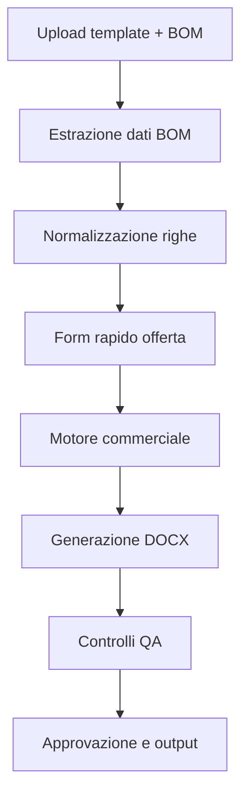

# Offerta Builder

Offer Builder **controllato**: importa le BOM dei distributori, applica le regole
commerciali e genera l'offerta sul template Word aziendale.

Il perimetro e' netto, ed e' la ragione d'essere del progetto:

| Chi decide | Cosa |
| ---------- | ---- |
| **Regole deterministiche** | calcoli, margini, IVA, date, validita', condizioni, quadrature |
| **AI (opzionale)** | interpretazione dei file e riscrittura dei soli testi discorsivi |

L'AI non inventa prezzi: la riscrittura assistita e' opt-in e ogni testo passa da
un guard numerico che scarta qualunque cifra non presente nei dati calcolati.

## Flusso



Ogni fase e' un cancello: se manca un dato, il flusso **si ferma e chiede conferma**
invece di stimare.

## Moduli

| Modulo | File | Cosa fa |
| ------ | ---- | ------- |
| BOM Importer | `offerta_builder/bom/reader.py` | legge CSV/TSV, XLSX e PDF (tabelle vettoriali o testo allineato) |
| BOM Normalizer | `offerta_builder/bom/normalizer.py` | porta ogni BOM allo schema unico, deriva i campi mancanti, segnala le incoerenze |
| Distributori | `offerta_builder/bom/distributors.py` | riconosce V-Valley, Computer Gross, Esprinet, Ingram, TD SYNNEX, ALSO, Attiva, Icos |
| Quick Form | `offerta_builder/form.py` | campi obbligatori/opzionali, validazione P.IVA e date, precompilazione da BOM |
| Pricing Engine | `offerta_builder/pricing.py` | markup, margine obiettivo, prezzo manuale, IVA, servizi, annualita' |
| Content Generator | `offerta_builder/content.py` | oggetto, premessa, descrizione servizi, requisiti, esclusioni (+ guard numerico AI) |
| Template Manager / DOCX Builder | `offerta_builder/docx_builder.py` | compila il template AD con `docxtpl`, oppure costruisce il documento da zero |
| QA Agent | `offerta_builder/qa.py` | segnaposto, date, titoli duplicati, quadrature, IVA, margini, condizioni |
| Riepilogo interno | `offerta_builder/report.py` | HTML con costi, margini e anomalie, a uso interno |
| Orchestratore | `offerta_builder/pipeline.py` | esegue il flusso e scrive gli output |

## Installazione

```bash
pip install -e .            # oppure: pip install -r requirements.txt
```

Per l'installazione passo passo (Windows, macOS, Linux), prerequisiti e problemi
frequenti: **[INSTALL.md](INSTALL.md)**.

Il deliverable normale e' il **DOCX**, cosi' resta modificabile a mano prima
dell'invio. Il PDF e' opzionale (`--pdf`) e richiede LibreOffice **con il modulo
Writer**:

```bash
sudo apt-get install libreoffice-writer     # Debian/Ubuntu
```

Senza LibreOffice il DOCX viene comunque generato e il PDF viene segnalato come
non prodotto (mai silenziosamente saltato).

## Uso

```bash
# 1. crea il form rapido, gia' precompilato con cio' che si deduce dalla BOM
python -m offerta_builder.cli form-init -o form_offerta.json --bom examples/bom_vvalley_solarwinds.csv

# 2. controlla come viene letta la BOM (sola lettura)
python -m offerta_builder.cli bom examples/bom_vvalley_solarwinds.csv

# 3. genera l'offerta (esce il DOCX, da rileggere e ritoccare)
python -m offerta_builder.cli build \
    --bom examples/bom_vvalley_solarwinds.csv \
    --form examples/form_offerta.json \
    --template templates/offerta_ad_template.docx \
    --out out

# 4. solo a offerta chiusa, se serve anche il PDF
python -m offerta_builder.cli build ... --pdf

# variante guidata: chiede a video i campi mancanti e l'approvazione prima del PDF
python -m offerta_builder.cli build --bom <file> --interattivo --template <template> --out out
```

Dopo `pip install -e .` gli stessi comandi sono disponibili come `offerta ...`.

Opzioni utili di `build`: `--modo {markup,target_margin,manual}`, `--markup 35`,
`--margine 30`, `--arrotondamento {none,0.01,1,10,100}`, `--pdf`, `--ai`,
`--force`, `--json`.

Codici di uscita: `0` tutto ok, `2` flusso bloccato prima della generazione,
`3` documento generato ma QA in errore.

## Output

| File | Contenuto |
| ---- | --------- |
| `offerta.docx` | offerta compilata sul template AD: e' il deliverable, si ritocca a mano |
| `offerta.pdf` | solo con `--pdf`, e solo a QA superato |
| `bom_normalizzata.json` | BOM nello schema unico, con le anomalie di import |
| `dati_offerta.json` | righe, totali, annualita': la fonte numerica del documento |
| `controlli_qa.json` | esito di ogni controllo, con dettagli |
| `riepilogo_interno.html` | costi, margini e note interne, **da non inviare al cliente** |

## Schema dati unico della BOM

```json
{
  "distributor": "V-Valley",
  "vendor": "SolarWinds",
  "quote_number": "Q-883436",
  "end_user": "BPER_Banca S.p.A",
  "valid_until": "2026-07-31",
  "currency": "EUR",
  "items": [
    {
      "period": "31 Dec 2026 - 30 Dec 2027",
      "quantity": 1,
      "sku": "2078005",
      "description": "SolarWinds Network Performance Monitor SLX",
      "category": "Subscription",
      "list_price_unit": 28692.00,
      "list_price_total": 28692.00,
      "discount_percent": 66.02,
      "cost_net_total": 9749.30,
      "sell_net_total": 12186.63,
      "vat_total": 2681.06,
      "sell_gross_total": 14867.69
    }
  ]
}
```

I campi `sell_*` e `vat_*` sono valorizzati **solo** dal motore commerciale: nel
file del distributore ci sono costi, non prezzi al cliente.

Colonne riconosciute automaticamente (IT/EN): codice/SKU/part number, descrizione,
quantita', prezzo di listino, totale listino, sconto %, netto unitario, totale
netto, periodo, categoria, valuta, vendor, note. Le colonne non riconosciute
vengono elencate come avviso.

## Regole del motore commerciale

1. La BOM del distributore e' **costo di acquisto**, mai offerta al cliente.
2. Il prezzo cliente si ottiene in tre modi, combinabili per riga:
   - `markup`: `prezzo = costo x (1 + markup%)`
   - `target_margin`: `prezzo = costo / (1 - margine%)` (margine sul venduto)
   - `manual`: prezzo indicato a mano nelle deroghe di riga
3. Tutti i totali (listino, costo, imponibile, IVA, lordo, riepilogo annuale)
   sono **ricalcolati** dal backend, mai copiati dal file.
4. I calcoli usano `Decimal` con arrotondamento half-up a due decimali.
5. Se un dato manca o e' incoerente, il flusso si ferma: si prosegue solo con
   `--force`, e l'anomalia resta scritta negli output.

### Deroghe di riga

```json
"pricing": {
  "mode": "target_margin",
  "target_margin_percent": 32,
  "rounding": "0.01",
  "overrides": [
    { "match": "SW-SUP-PREM", "mode": "markup", "markup_percent": 25 },
    { "match": "2078005", "sell_net_total": 12500 }
  ]
}
```

`match` accetta uno SKU esatto o un pezzo di descrizione.

## Controlli QA

Prima dell'export PDF vengono verificati:

- segnaposto rimasti nel documento (`{{ ... }}`, `<<...>>`, `TBD`, `XXXX`);
- date valide (`31-9-2026` viene rifiutata) e validita' successiva alla data offerta;
- validita' dell'offerta non oltre quella della quotazione distributore;
- titoli incollati (`PremessaPremessa`) o sezioni ripetute;
- somma delle righe uguale al totale offerta, e riepilogo annuale coerente;
- IVA ricalcolata riga per riga;
- margine totale e di riga sopra la soglia minima;
- condizioni di pagamento, fatturazione e campi obbligatori compilati;
- totale calcolato effettivamente presente nel documento generato.

Il DOCX viene sempre prodotto, anche a QA rosso: serve proprio a vedere e
correggere il problema. Un esito `fail` blocca invece la conversione in PDF; gli
avvisi passano ma restano scritti in `controlli_qa.json` e nel riepilogo interno.

## Template

`templates/offerta_ad_template.docx` e' un template di riferimento generato da
`scripts/make_template.py`. Per usare il template AD reale basta inserirci gli
stessi segnaposto:

- campi semplici: `{{ cliente }}`, `{{ piva }}`, `{{ referente }}`, `{{ oggetto }}`,
  `{{ autore }}`, `{{ riferimento_offerta }}`, `{{ data_offerta }}`,
  `{{ validita_offerta }}`, `{{ premessa }}`, `{{ descrizione_fornitura }}`,
  `{{ tipologia_pagamento }}`, `{{ condizioni_pagamento }}`, `{{ fatturazione }}`,
  `{{ durata_contratto }}`, `{{ rinnovo }}`, `{{ totale_imponibile }}`,
  `{{ totale_iva }}`, `{{ totale_offerta }}`;
- righe dell'offerta economica: una riga con ``, la riga
  modello con `{{ riga.codice }}`, `{{ riga.descrizione }}`, `{{ riga.periodo }}`,
  `{{ riga.quantita }}`, `{{ riga.prezzo_unitario }}`, `{{ riga.totale }}`, e una
  riga con ``;
- elenchi puntati: `` / `{{ requisito }}` /
  `` (idem per `esclusioni`, `note_commerciali`, `allegati`,
  `descrizione_servizi`).

> Le righe che contengono un tag `` vengono sostituite dal tag stesso:
> i marcatori del ciclo vanno quindi in righe dedicate.

Senza `--template` il documento viene costruito da zero (copertina, oggetto,
premessa, offerta economica, condizioni, accettazione, allegati).

## Assistenza AI (opzionale)

```bash
export ANTHROPIC_API_KEY=...
pip install -e ".[ai]"
python -m offerta_builder.cli build ... --ai
```

Vengono riscritti solo `premessa` e `descrizione_fornitura`. Se il testo prodotto
contiene numeri non presenti nei dati calcolati, la riscrittura viene **scartata**
e resta il testo deterministico, con un avviso nel QA.

## Test

```bash
pip install pytest
python -m pytest
```

## Esempi

- `examples/bom_vvalley_solarwinds.csv` - BOM V-Valley/SolarWinds
- `examples/bom_computergross_multivendor.xlsx|.pdf` - BOM Computer Gross multi-vendor
- `examples/form_offerta.json` - form rapido compilato
- `python examples/make_samples.py` - rigenera gli esempi XLSX e PDF
